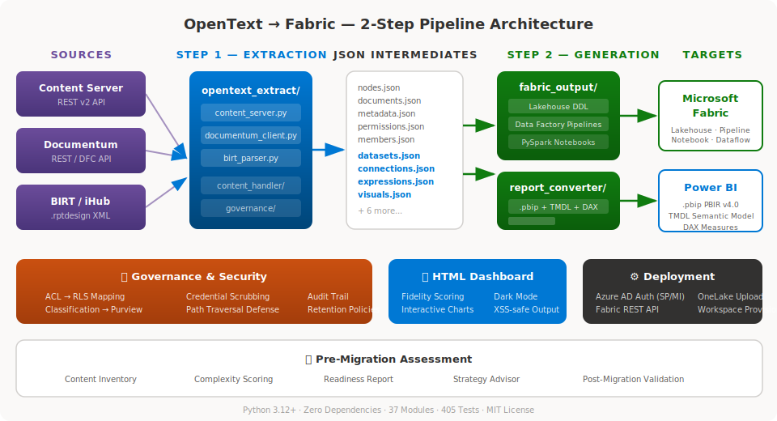

<p align="center">
  
</p>

<p align="center">
  <strong>Automated migration of OpenText ECM &amp; BIRT reports to Microsoft Fabric and Power BI</strong>
</p>

<p align="center">
  <a href="#quick-start">Quick Start</a> ·
  <a href="#architecture">Architecture</a> ·
  <a href="#output-artifacts">Artifacts</a> ·
  <a href="#html-migration-dashboard">Dashboard</a> ·
  <a href="docs/AGENTS.md">Agents</a> ·
  <a href="docs/ARCHITECTURE.md">Deep-Dive</a>
</p>

<p align="center">
  
  
  
  
  
  
  
</p>

---

## Overview

**OpenTextToFabric** extracts content, metadata, reports, and permissions from OpenText systems and generates ready-to-deploy Microsoft Fabric artifacts and Power BI reports — in a single CLI command.

| Capability | Details |
|:---|:---|
| **53 source modules** | Extraction, conversion, governance, deployment, reporting, telemetry |
| **878 tests** | Comprehensive coverage across 45 test files |
| **Zero dependencies** | Pure Python stdlib — no pip install needed for core |
| **10-agent architecture** | Specialized agents for each migration concern |
| **140+ visual types** | BIRT visuals → PBI visual mappings (3D, combo, sankey, sparkline, …) |
| **40+ M query connectors** | JDBC → Power Query M (Oracle, PostgreSQL, Snowflake, BigQuery, …) |
| **HTML dashboard** | Interactive migration report with fidelity scoring |

---

## Architecture

<p align="center">
  
</p>

The tool follows a **2-step pipeline** design — identical to the proven [TableauToPowerBI](https://github.com/cyphou/TableauToPowerBI) architecture:

```
Step 1: EXTRACTION                        Step 2: GENERATION
┌──────────────────┐                      ┌──────────────────┐
│  Content Server  │──┐                   │  fabric_output/  │──→  Fabric Lakehouse
│  Documentum      │──┤──→ 15+ JSON ──→──┤  report_converter/│──→  Power BI .pbip
│  BIRT .rptdesign │──┘    intermediates  │  governance/     │──→  RLS + Purview
└──────────────────┘                      └──────────────────┘
```

Each JSON intermediate is a clean, inspectable contract between the two steps. See [docs/ARCHITECTURE.md](docs/ARCHITECTURE.md) for the full deep-dive and [docs/AGENTS.md](docs/AGENTS.md) for the 10-agent model.

---

## Quick Start

### Content Server → Fabric Lakehouse

```bash
python migrate.py \
  --source-type content-server \
  --server-url https://cs.example.com/otcs/cs.exe \
  --username admin --password-env OT_PASSWORD \
  --scope "/Enterprise/Finance" \
  --output-dir ./output
```

### BIRT Report → Power BI

```bash
python migrate.py \
  --source-type birt \
  --input ./reports/sales_report.rptdesign \
  --output-dir ./output
```

### Pre-Migration Assessment

```bash
python migrate.py \
  --source-type content-server \
  --server-url https://cs.example.com/otcs/cs.exe \
  --assess-only \
  --output-dir ./assessment
```

### Full Migration (all sources → all targets)

```bash
python migrate.py \
  --source-type all \
  --server-url https://cs.example.com/otcs/cs.exe \
  --username admin --password-env OT_PASSWORD \
  --input ./reports/ \
  --output-format both \
  --output-dir ./output
```

> **Tip:** Add `-v` for INFO logging or `-vv` for DEBUG. Use `--no-report` to skip HTML dashboard generation.

---

## Supported Sources

| Source | API | Output |
|:---|:---|:---|
| **OpenText Content Server** | REST v2 | Lakehouse + Data Factory + Notebooks |
| **OpenText Documentum** | REST / DFC | Lakehouse + Data Factory + Notebooks |
| **BIRT / iHub** | .rptdesign XML | Power BI (.pbip PBIR v4.0 + TMDL) |

---

## Output Artifacts

### 🔷 Fabric Native

| Artifact | Description |
|:---|:---|
| **Lakehouse DDL** | Delta table schemas for documents, metadata, classifications |
| **Data Factory Pipelines** | REST connector → OneLake copy activities (3-stage orchestration) |
| **PySpark Notebooks** | ETL for document processing, metadata enrichment, OCR |
| **Dataflow Gen2** | Power Query M for incremental data ingestion |
| **TMDL Semantic Model** | Tables, columns, measures, relationships, hierarchies, calc groups, RLS |

### 🟡 Power BI (from BIRT reports)

| Artifact | Description |
|:---|:---|
| **.pbip Project** | PBIR v4.0 report definition with bookmarks |
| **DAX Measures** | 80+ BIRT JavaScript → DAX conversions + DAX optimizer |
| **Power Query M** | 40+ connectors (Oracle, PostgreSQL, Snowflake, BigQuery, MongoDB, …) |
| **Visual Mappings** | 140+ BIRT visual → PBI visual type mappings + alias resolution |
| **TMDL Hierarchies** | Auto-inferred date/geography hierarchies, calculation groups, RLS roles |
| **DAX Recipes** | Industry-specific KPI templates (Healthcare, Finance, Retail, Manufacturing) |

### 🟠 Governance & Security

| Artifact | Description |
|:---|:---|
| **RLS Roles** | Mapped from Content Server / Documentum ACLs |
| **Purview Sensitivity Labels** | Mapped from OpenText classifications |
| **Retention Policies** | Mapped to Purview retention |
| **Audit Trail** | Complete migration evidence chain (JSON + CSV) |
| **Security Validation** | Path traversal defense, credential scrubbing, ZIP-slip protection |

### 🟣 Enterprise Features

| Artifact | Description |
|:---|:---|
| **Multi-Tenant Deployment** | Template-based workspace creation with per-tenant substitutions |
| **Bundle Deployer** | Shared semantic model + thin report bundles |
| **Refresh Schedules** | BIRT/iHub/cron schedules → PBI refresh configuration |
| **Gateway Config** | JDBC connections → PBI gateway bindings (Oracle, PostgreSQL, SQL Server, …) |
| **Telemetry** | Event tracking, HTML dashboard, Prometheus/Azure Monitor export |
| **Regression Suite** | Snapshot-based drift detection, visual diff, comparison reports |
| **Change Detection** | File-hash + mtime incremental sync engine |
| **Recovery Report** | Self-healing failure tracking with retry recommendations |
| **Artifact Healer** | 23 self-healing methods (DAX, TMDL, M queries, PBIR visuals) |
| **SLA Tracker** | Per-report duration and fidelity compliance monitoring |
| **Plugin System** | Extensible visual mapping and DAX post-processing hooks |

---

## HTML Migration Dashboard

Every migration produces an interactive **MIGRATION_REPORT.html** — a professional dashboard built with the same Fluent/Power BI design language used in the TableauToPowerBI project.

### Features

- 📊 **Executive Summary** — stat cards, overall fidelity score, category breakdown
- 📦 **Extraction Overview** — donut charts by category, bar charts by node type
- 📄 **Content Inventory** — sortable, searchable table of all extracted items
- 🔐 **Governance Mapping** — ACL → RLS role mapping with status badges
- 🔧 **Expression Conversion** — BIRT JS → DAX success/partial/unsupported breakdown
- ⚙️ **Fabric Artifacts** — pipeline flow diagram, generated file listing
- 📈 **BIRT Report Conversion** — visual/dataset/connection tabs
- 📋 **Audit Trail** — timestamped event log
- 🌙 **Dark Mode** — toggle with persistent preference
- 🖨️ **Print-ready** — clean print stylesheet
- 🛡️ **XSS-safe** — all user data HTML-escaped

> Generate with `python -c "from reporting.generate_report import generate_report; generate_report('./output')"`

---

## Project Structure

```
OpenTextToFabric/
├── migrate.py                  # CLI entry point & pipeline orchestrator
├── config.py                   # MigrationConfig (from_args / from_file / validate)
├── progress.py                 # Step-level progress tracking + checkpoints
│
├── opentext_extract/           # ── Step 1: Extraction ──────────────────
│   ├── api_client.py           #    Base REST client (auth, pagination, retry)
│   ├── content_server.py       #    Content Server REST v2 → 5 JSON files
│   ├── documentum_client.py    #    Documentum REST → 5 JSON files
│   ├── birt_parser.py          #    .rptdesign XML → 4 JSON files
│   └── ihub_client.py          #    iHub/ERES REST API integration
│
├── content_handler/            # ── Document Binary Management ──────────
│   ├── downloader.py           #    Chunked download with resume
│   ├── renditions.py           #    Format variant handling
│   ├── versioning.py           #    Version chain extraction
│   └── ocr_client.py           #    Azure AI Document Intelligence
│
├── report_converter/           # ── BIRT → Power BI Conversion ──────────
│   ├── expression_converter.py #    80+ BIRT JS → DAX mappings
│   ├── visual_mapper.py        #    140+ BIRT visuals → PBI visual configs + alias resolution
│   ├── pbip_generator.py       #    .pbip PBIR v4.0 project output + bookmarks + sanitized field refs
│   ├── conditional_format.py   #    BIRT highlight rules → PBI formatting
│   ├── drill_through.py        #    Drill-through page generation
│   ├── multi_datasource.py     #    Multi-source composite model builder
│   ├── dax_optimizer.py        #    AST-based DAX rewriter (IF→SWITCH, etc.)
│   └── plugins.py              #    Plugin system for custom visual/DAX hooks
│
├── fabric_output/              # ── Step 2: Fabric Generation ───────────
│   ├── fabric_constants.py     #    Spark type maps, sanitization
│   ├── lakehouse_generator.py  #    Delta table DDL
│   ├── pipeline_generator.py   #    Data Factory pipeline JSON
│   ├── notebook_generator.py   #    PySpark notebook generation
│   ├── dataflow_generator.py   #    Dataflow Gen2 (Power Query M)
│   ├── tmdl_generator.py       #    TMDL semantic model + hierarchies + calc groups + RLS
│   └── m_query_generator.py    #    40+ Power Query M connectors + BIRT computed columns
│   └── dax_recipes.py          #    Industry-specific KPI measure templates
│
├── governance/                 # ── Permission & Compliance ─────────────
│   ├── acl_mapper.py           #    CS/DCTM ACL → RLS role mapping
│   ├── classification_mapper.py#    Categories → Purview sensitivity labels
│   ├── purview_mapper.py       #    Retention → Purview policies
│   ├── audit.py                #    Migration audit trail (JSON/CSV export)
│   └── security_validator.py   #    Path traversal, credential scrub, XXE
│
├── reporting/                  # ── HTML Dashboard & Observability ─────
│   ├── html_template.py        #    Fluent/PBI CSS + JS + 15 components
│   ├── migration_report.py     #    Per-item fidelity tracking & scoring
│   ├── generate_report.py      #    8-section dashboard builder
│   ├── telemetry.py            #    Event tracking, Prometheus/Azure Monitor export
│   ├── regression.py           #    Snapshot drift detection, visual diff, comparison
│   └── incremental.py          #    Change detection, recovery report, SLA tracker
│
├── assessment/                 # ── Pre-Migration Analysis ──────────────
│   ├── scanner.py              #    Content inventory
│   ├── complexity.py           #    Complexity scoring
│   ├── readiness_report.py     #    HTML readiness dashboard
│   ├── validator.py            #    Post-migration validation
│   ├── artifact_healer.py      #    23-method self-healing (DAX, TMDL, M, PBIR)
│   └── strategy_advisor.py     #    Migration strategy recommendation
│
├── deploy/                     # ── Fabric Deployment ───────────────────
│   ├── auth.py                 #    Azure AD (Service Principal + MI)
│   ├── fabric_client.py        #    Fabric REST API client
│   ├── deployer.py             #    Workspace provisioning & deploy
│   ├── onelake_client.py       #    ADLS Gen2 / OneLake upload
│   ├── multi_tenant.py         #    Template-based multi-tenant deployment + bundle
│   └── refresh_gateway.py      #    BIRT/cron schedule → PBI refresh + gateway mapping
│
├── tests/                      # 878 tests across 45 test files
├── docs/                       # Architecture, agents, dev plan
│   ├── assets/                 #    Logo + architecture SVG
│   ├── ARCHITECTURE.md
│   ├── AGENTS.md
│   └── DEVELOPMENT_PLAN.md
└── .github/
    ├── agents/                 # 10 agent definitions
    └── workflows/              # CI/CD pipelines
```

---

## Development

```bash
# Clone
git clone https://github.com/cyphou/OpenTextToFabric.git
cd OpenTextToFabric

# No install needed — zero dependencies
# Just run tests directly:
python -m pytest tests/ -v

# Or with a venv:
python -m venv .venv
.venv\Scripts\activate          # Windows
source .venv/bin/activate       # macOS/Linux
pip install -e ".[dev]"
pytest tests/ -v
```

### Requirements

- **Python 3.12+**
- **Zero external dependencies** for core migration
- Optional: `azure-ai-documentintelligence` (OCR), `azure-identity` (deployment)

---

## CLI Reference

```
usage: migrate [-h] --source-type {content-server,documentum,birt,all}
               [--server-url URL] [--username USER] [--password-env VAR]
               [--scope PATH] [--input PATH] [--output-dir DIR]
               [--output-format {fabric,pbip,both}] [--assess-only]
               [--batch] [--deploy] [--workspace-id ID] [--tenant-id ID]
               [--no-report] [-v]
```

| Flag | Description |
|:---|:---|
| `--source-type` | `content-server`, `documentum`, `birt`, or `all` |
| `--output-format` | `fabric` (Lakehouse), `pbip` (Power BI), or `both` (default) |
| `--assess-only` | Run pre-migration assessment without migrating |
| `--no-report` | Skip HTML migration report generation |
| `--deploy` | Deploy generated artifacts to a Fabric workspace |
| `-v` / `-vv` | INFO / DEBUG logging |

---

## 10-Agent Architecture

The project uses specialized [AI agents](docs/AGENTS.md) for each migration concern:

| Agent | Responsibility |
|:---|:---|
| **@orchestrator** | Pipeline coordination, CLI, batch processing |
| **@extractor** | OpenText API integration & JSON extraction |
| **@content** | Document binary handling (download, renditions, OCR) |
| **@report** | BIRT → Power BI report conversion |
| **@semantic** | TMDL semantic model generation |
| **@pipeline** | Fabric artifact generation (Lakehouse, Notebooks, Dataflows) |
| **@governance** | Permission & compliance mapping |
| **@assessor** | Pre-migration analysis & readiness scoring |
| **@deployer** | Fabric workspace deployment |
| **@tester** | Test creation & validation |

---

## Related Projects

| Project | Description |
|:---|:---|
| [**TableauToPowerBI**](https://github.com/cyphou/TableauToPowerBI) | Sister project — Tableau workbook migration to Power BI |

---

## License

[MIT](LICENSE) — free for commercial and personal use.
